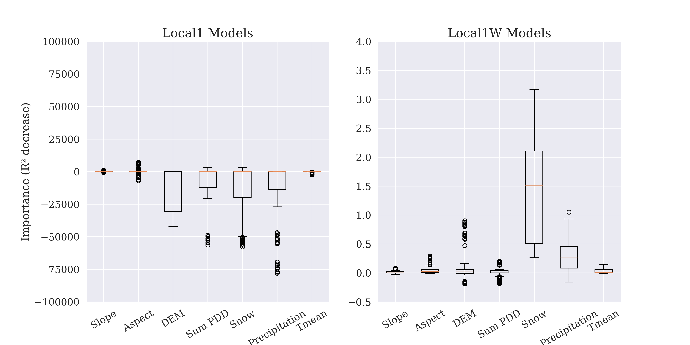
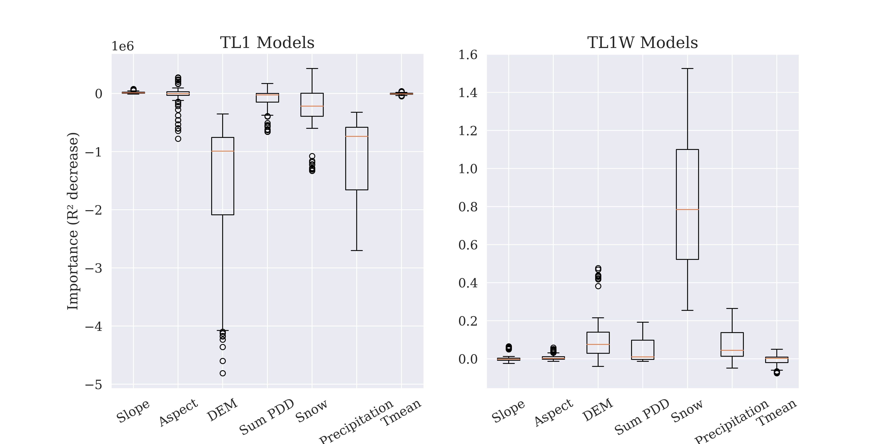
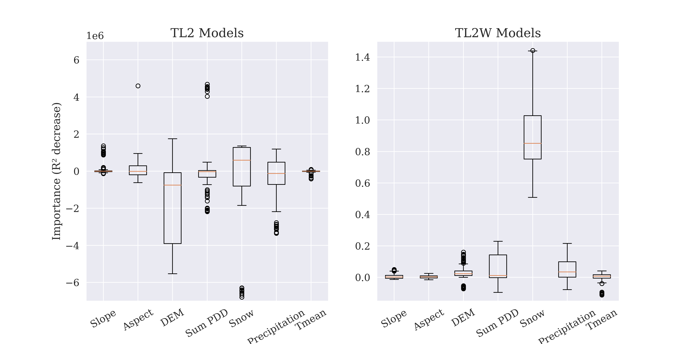

# Modeling Spatial Distribution of Snow Water Equivalent using Transfer Learning across Mountainous Basins
Accurately estimating snow water equivalent (SWE) is crucial for understanding the impacts of climate change, urbanization, and population growth on water resources. High operational costs of lidar observations limit the frequency and coverage of SWE estimates at high spatial resolutions, leading to significant data gaps. We address this challenge with a transfer learning framework that leverages abundant SWE data from California to enhance predictions in Colorado, where data are scarce. From 2016 to 2019, the disparity in SWE data collection between these states was stark: 94 snowpack maps were recorded in California's Sierra Nevada versus only 12 in Colorado's Rocky Mountains. We hypothesized that geographic predictors (e.g., elevation and snowfall) would exhibit similar effects on SWE across these landscapes. By conducting an explanatory factor analysis, we validated this hypothesis and refined our transfer learning model, which incorporated data based on 80 snowpack maps from California to predict SWE in Colorado. Compared to using data from Colorado alone, transfer learning improved the mean $R^2$ value from 0.45 to 0.54, representing a significant enhancement of 20\% in predictive accuracy, while reducing bias from 0.24 to 0.17 (a 30\% decrease). Such advancements underscore the potential of our framework to mitigate lidar data limitations, offering a valuable tool for water resource management amidst changing environmental conditions. 

**To reproduce this work please use python 3.6.1, Keras 2.6.0, and Tensorflow 2.6.2 versions.**
## Datasets

• Lidar data: we obtained lidar-derived SWE from the Airborne Snow Observatory (ASO) with a 50 m resolution (T. Painter, 2018). ASO data in Colorado consist of 12 maps across five basins from 2016 to 2019: Blue River (BR), Crested Butte (CB), Maroon/Castle Creek (CM), Gunnison-East River (GE), and Gunnison-Taylor River (GT) basins. ASO data in California are more frequent and consist of 94 maps across 13 basins, serving as a rich source for transfer learning. Following quality control measures, we considered 80 maps across 11 basins from 2013 to 2019: Cherry Eleanor (CE), Kings Canyon (KC), Kings North (KN), Lakes Basin (LB), LEE Vining Creek (LV), Merced River (MB), Rush Creek (RC), San Joaquin South Fork (SF), San Joaquin Main Fork (SJ), Tuolumne River (TB), Tuolumne + Cherry/Eleanor (TE).

• Gridded meteorological datasets: we obtained gridded estimates of daily preciptation and temperature from the Parameter elevation Relationships on Independent Slopes Model (PRISM) data (Daly et al., 2008) at a spatial resolution of 800 m. Using these datasets, we derived four meteorological variables that are strongly correlated to the spatial distribution of SWE: accumulated snow, sum positive degree days (PDD), accumulated precipitation, and mean seasonal temperature.

• Elevation maps: we obtained elevation maps from National Elevation Dataset at a resolutionof 10 m (Gesch et al., 2018). These maps were used to extract topographic variables that influence snow melt and snow accumulation processes: slope, aspect, and elevation. 

These datasets were rescaled to 800 m and reprojected to a consistent coordinate system for consistency.

<image src="./Figures/spatial_extent.jpg">

Figure 1: Spatial extent and frequency of lidar-derived SWE maps used in this study. Basin names are abbreviated for brevity. 

 

| File | Description |
| ------------- | ------------- |
| `California CSV files/ Colorado CSV files` | Generated CSV datasets for Colorado and California. |
| `Final_processed_California_topography_SWE_snapshots.zip` | Processed ASO SWE maps and Topography files in California. |
| `Final_processed_Colorado_topography_SWE_snapshots.zip` | Processed ASO SWE maps and Topography files in Colorado. |

## Transfer Learning and Benchmark Models
We adopted a feed-forward ANN architecture, initially training a Base model on the source data which corresponds to California's 80 SWE maps. Subsequently, we considered four different modeling approaches to adapt the Base model to perform the target task of predicting SWE in Colorado (Figure 2). The first two approaches were: 

• Model TL1: This involved freezing the shallower layers (preventing their weights from changing) and retraining only the deeper layers.

• Model TL2: This involved freezing all the weights of the model, removing deeper layers, and adding new layers whose weights were trained on the target data.

The two approaches were picked because the deeper layers help capture the higher-order complexities in the relationship between input features and the output, while the shallower layers generally capture coarser and simpler relationships. Analysis using permutation feature importance revealed that the transfer learning models under TL1 and TL2 gave lower importance to elevation, accumulated snow, and accumulated precipitation- variables identified as critical for determining SWE in Colorado based on EFA results (Figures 3 and 4). To address this discrepancy, we introduced two additional transfer learning approaches that explicitly prioritized these variables by prescribing their importance:

• Model TL1W: This utilized the architecture and hyperparameters of the best performing set of TL1 models but modified the scaled input features by multiplying elevation, accumulated snow, and accumulated precipitation by (scalar) weights equal or greater than 1. These weights were treated as hyperparameters and optimized using Optuna, an open-source framework for automatic hyperparameter optimization.

• Model TL2W: This followed the same principle as TL1W, but used the architecture and hyperparameters of the best performing set of TL2 models. The weights for elevation, accumulated snow and accumulated precipitation were again optimized using Optuna.

The performance of transfer learning models was benchmarked against local models trained only on data from Colorado. This helps to validate the added value of transfer learning in improving SWE prediction accuracy. We considered two versions of local models:

• Local 1: This considers scaled input variables per the usual machine learning practice

• Local 1W: This followed the same principle as TL1W, but used the architecture and hyperparameters of the best performing set of Local 1 models. The weights for elevation, accumulated snow and accumulated precipitation were again optimized using Optuna.

All models, except the base models, were trained between September and November 2024 using the specified Python and Keras versions (python 3.6.1, Keras 2.6.0, and Tensorflow 2.6.2 versions). The architectures for the local models were optimized by Ax in a prior study (2022) and saved. To ensure version alignment for accurate comparison, the saved architectures were cloned, and new local models were retrained using python 3.6.1, Keras 2.6.0, and Tensorflow 2.6.2 versions. Two sets of Local 1 models are available on GitHub: one serves as the architecture template for the retrained models (`Colorado_ScaledLMs.zip`), while the second set comprises the models being compared in this study (`Local_1.tar`).

<image src="./Figures/TL_schematic.png">

Figure 2: Schematic describing the different TL models considered in this study. 

 
  
| File | Description |
| ------------- | ------------- |
| `Base_models.zip` | The 5 trained Base models. The Base model used in transfer learning is Base model 3. |
| `Local_1.tar` | 12 Local 1 models|
| `Local_1_W.tar` | 12 Local 1W models|
| `TL1.tar` | 12 TL1 models |
| `TL1_W.tar.zip` | 12 TL1W models |
| `TL2.tar` | 12 TL2 models |
| `TL2_W.tar` | 12 TL2W models |
| `Colorado_ScaledLMs.zip` | 12 older Local 1 models that serve as the architecture template of Local 1 and Local 1W models |

## Code Description
Bayesian Hyperparameter optimization for Base models and Local 1 models was conducted using the opensource framework Ax, Adaptive Experimentation platform (Bakshy et al., 2018), following this [**tutorial**](https://www.justintodata.com/hyperparameter-tuning-with-python-keras-guide/). The hyperparameter search space included activation function, feature scaling techniques, optimization function, learning rate, number of hidden layers, number of neurons per layer, dropout rate, L1 and L2 regularization rates, and batch size. 

For TL1 and TL2 models, the hyperparameters were kept consistent with those optimized for the Base model. However, hyperparameter tuning specific to transfer learning was performed manually for parameters unique to these models, including the number of frozen hidden layers, the number of removed hidden layers, and the number of newly added hidden layers. Each type of Local and TL models was trained using a leave-one-out (LOO) cross-validation approach to ensure robust performance evaluation. Lastly, Factor Analysis was conducted using the package FactorAnalyzer in Python with varimax rotation (Biggs & Madnani, 2021). 
| File | Description |
| ------------- | ------------- |
| `California_base_models.ipynb/California_base_models_sample_code.ipynb` | Jupyter Notebook used for hyperparameter optimization, training and testing of ANNs on California data to predict SWE in California. 5 models are trained each with a different training/validation split. The models are called Base models. Notebook California_base_models.ipynb shows the training procedure of Base model 3 and the test results. Base model 3 is the base model used for transfer learning. California_base_models_sample_code.ipynb is a cleaned sample code. |
| `Local_Hyperparam_Optimization.ipynb` | Jupyter Notebook used for hyperparameter optimization, training and testing of ANNs on Colorado data to predict SWE in Colorado. 12 models are trained and tested using the LOO method since there are 12 SWE maps. The models are the 12 older Local 1 models that serve as the architecture template of Local 1 and Local 1W models. |
| `TL1-TL2-Local1.ipynb` | Jupyter Notebook used for transfer learning according to approaches TL1 and TL2 and used to train Local 1 models after cloning the archtiectures found in `Colorado_ScaledLMs.zip` produced by `Local_Hyperparam_Optimization.ipynb`.|
| `TL1W_Training.ipynb/TL2W_Training.ipynb` | Jupyter Notebooks used for transfer learning and weighting optimization according to approaches TL1W and TL2W, respectively.|
| `Local_1W_Training.ipynb` | Jupyter Notebook used for training and weighting optimization according to approach Local 1W.|
| `FA_winter/FA_summer.ipynb` | Jupyter Notebooks used to apply explanatory factor analysis on California and Colorado winter (March/April) and summer (June) data.|
| `Colorado_data_processing.ipynb/California_data_processing.ipynb` | Jupyter Notebooks used to process the raw Colorado/California data (ASO Lidar-maps, Elevation maps, and PRISM data), generates the datasets (CSV files) for training ANNs and plot backward accumulation plots. |
|`Results.ipynb` | Jupyter Notebook used to plot true and predicted SWE maps (scatter plots), calculates $R^2$, bias and $KGE$ results, and plots feature importance box plots.|

## Factor Analysis Results

We developed four explanatory factor analysis (EFA) models: two EFA models describing Colorado datasets (one each for March-April and June), and two EFA models describing California datasets (one each for March-April and June). EFA models captured between 0.64 to 0.72 of the total variance in our dataset. All models were able to capture a large proportion of the variance in elevation, accumulated snow, accumulated precipitation, sum PDD (with the exception for March-April in Colorado), and $T_{mean}$. For SWE, the four EFA models were able to capture 0.75, 0.78, 0.74, and 0.57 of the variance.

To further investigate the regional and seasonal variability in how the predictor variables affect SWE, we resorted to factor loading plots shown in Figures 3 and 4. These plots illustrate the association between variables and latent factors. Each latent factor can be considered to be a proxy or latent representation of underlying physical phenomena that influence snowpack. Factors are arranged based on the amount of variance they capture from the data, listed in descending order. Three factors were found to fit Colorado datasets best, while two factors yielded the best fit for California datasets.

Colorado in March/April         |  California in March/April
:-------------------------:|:-------------------------:
 |  

Figure 3: EFA Loading plots illustrating the principal factors for Colorado and California datasets in March/April. The x-axis represents the variable name, while the y-axis represents the variable loading.

 

Colorado in June         |  California in June
:-------------------------:|:-------------------------:
 |  

Figure 4: EFA Loading plots illustrating the principal factors for Colorado and California datasets in June. The x-axis represents the variable name, while the y-axis represents the variable loading.

 

The analysis reveals consistent patterns across both Colorado and California, with elevation and accumulated snow consistently driving high SWE values throughout different months. Additionally, low temperatures are consistently related to high SWE values in both regions across various time periods. This indicates that transfer learning could be implemented to predict SWE in Colorado using data from California. However, disparities emerge in the influence of precipitation and temperature-driven processes, with Colorado showing a stronger dependence on precipitation and California exhibiting a more pronounced sensitivity to temperature-related factors, particularly in March-April. There is also a disparity in the effect of slope on SWE values in Colorado and California. These point to differences in higher-order complexities in relationships between the predictors and SWE across Colorado and California. The importance of elevation, accumulated snow, and accumulated precipitation in Colorado, coupled with the reduced significance of precipitation in California, motivated the application of weights to these three variables in our modeling approach. Lastly, there is notable seasonal variability in SWE in Colorado, as evidenced by the more pronounced importance of temperature-related processes in June compared to March. 

## SWE Prediction Results

Table 1 summarizes the $R^2$, $KGE$, and normalized bias results for local models and TL models. The analysis of model performance across $KGE$, $R^2$, and absolute bias metrics demonstrates that TL1W and TL2W consistently outperform all other models. Additionally, TL1W models outperform TL2W models in terms of $KGE$ and absolute bias values. All transfer learning models (TL1, TL1W, TL2, TL2W) reduce standard deviations across metrics, emphasizing the robustness of transfer learning approaches overall. While unweighted transfer learning models (TL1, TL2) do not underperform compared to Local 1 models, they also fail to significantly outperform them in terms of $KGE$, $R^2$, and bias. Weighted local models (Local 1W) underperform relative to both Local 1 models and all transfer learning models. The performance gap between Local 1W and TL1W in $R^2$, $KGE$ and bias underscores that the benefits of weighting are more effectively realized when combined with transfer learning rather than applied to local-only models.

**Table 1: Comparison of model types across metrics**
| Metric                          | Local 1 | Local 1W | TL1  | TL1W | TL2  | TL2W |
|---------------------------------|---------|----------|------|------|------|------|
| Mean $R^2$                      | 0.45    | 0.38     | 0.43 | 0.53 | 0.44 | 0.54 |
| Mean $KGE$                      | 0.59    | 0.51     | 0.59 | 0.67 | 0.59 | 0.61 |
| Mean absolute normalized bias   | 0.24    | 0.25     | 0.26 | 0.17 | 0.26 | 0.21 |

## Feature Importance Results
Table 2 outlines the weights assigned to elevation, accumulated snow, and precipitation for each model type, while Figure 5 presents the feature importance results, illustrating the effects of weighting and transfer learning on predictor significance. The weighted models (Local 1W, TL1W, and TL2W) show significant increases in the importance of accumulated snow and precipitation, aligning with the applied weights for these variables, which exceed unity. Although the weighting for elevation is set to 1 in TL2W, its feature importance transitions from negative in TL2 to positive in TL2W. This indirect enhancement is driven by the weighting of accumulated snow and precipitation, suggesting that applying weights to certain variables can amplify the role of related predictors without directly weighting them.

In contrast, while elevation is also weighted at 1 in Local 1W, its importance remains unchanged compared to Local 1. This discrepancy underscores that transfer learning better captures the interactions between elevation and other predictors under a weighted scheme. Furthermore, the feature importance distributions of weighted models (Local  1W, TL1W, and TL2W) exhibit narrower interquartile ranges for key variables such as elevation, accumulated snow, and precipitation, reflecting more consistent contributions across test sets. Notably, TL1W and TL2W demonstrate less variability in feature importance distributions compared to Local 1W, highlighting that transfer learning combined with weighting stabilizes the influence of critical features.

**Table 2: Weighting values used for SWE modeling**
| Model    | Elevation | Accumulated Snow | Accumulated Precipitation |
|----------|-----------|------------------|---------------------------|
| Local 1W | 1         | 14               | 24                        |
| TL1W     | 3         | 16               | 5                         |
| TL2W     | 1         | 16               | 3                         |

  <h4>(a) Local Models</h4>
  

  <h4>(b) TL1 Models</h4>
  

  <h4>(c) TL2 Models</h4>
  

  <b>Figure 5:</b> Feature importance box plots for (a) Local Models, (b) TL1 Models, and (c) TL2 Models. The x-axis shows the variables, and the y-axis represents importance measured as R2 decrease.

## References
<a id="1">[1]</a> 
Painter, T. (2018). Aso l4 lidar snow water equivalent 50m utm grid, version 1, nasa national snow and ice data center distributed active archive center, boulder, colorado usa.

<a id="1">[2]</a> 
Daly, C., Halbleib, M., Smith, J. I., Gibson, W. P., Doggett, M. K., Taylor, G. H.,. . . Pasteris, P. P. (2008). Physiographically sensitive mapping of climatological temperature and precipitation across the conterminous united states. International Journal of Climatology: a Journal of the Royal Meteorologica Society, 28 (15), 2031–2064

<a id="1">[3]</a> 
Gesch, D. B., Evans, G. A., Oimen, M. J., & Arundel, S. (2018). The national elevation dataset. https://apps.nationalmap.gov. U.S. Geological Survey. (Accessed: 2022-04-15)

<a id="1">[4]</a> 
Biggs, J., & Madnani, N. (2021). factor analyzer. GitHub. Retrieved from https://github.com/EducationalTestingService/factor\ analyzer/blob/main/factor\ analyzer/factor\ analyzer.py

<a id="1">[5]</a> 
Bakshy, E., Dworkin, L., Karrer, B., Kashin, K., Letham, B., Murthy, A., & Singh,S. (2018). Ae: A domain-agnostic platform for adaptive experimentation.. Retrieved from https://api.semanticscholar.org/CorpusID:73557896

<a id="1">[6]</a> 
Chollet, F., et al. (2015). Keras. GitHub. Retrieved from https://github.com/fchollet/keras

<a id="1">[7]</a> 
Mital, U., Dwivedi, D.,  ̈Ozgen Xian, I., Brown, J. B., & Steefel, C. I. (2022, October). Modeling Spatial Distribution of Snow Water Equivalent by Combinin Meteorological and Satellite Data with Lidar Maps. Artificial Intelligence for the Earth Systems, 1 (4), e220010. Retrieved 2022-12-08, from https://journals.ametsoc.org/view/journals/aies/1/4/AIES-D-22-0010.1.xml 
doi: 10.1175/AIES-D-22-0010.1

